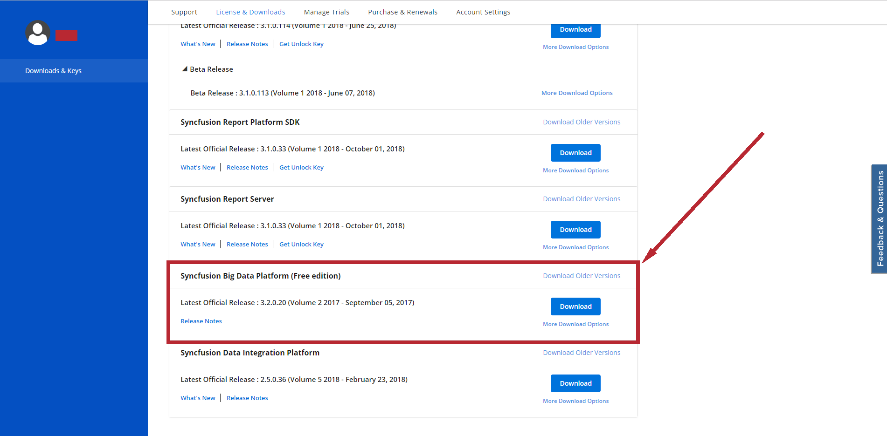

# hbase-on-windowns
Run Hadoop, Hbase on windowns 7/8/8.1/10

<h1>Installation Hbase</h1>
    <h2>Step 1</h2>
    <h4>Go to https://www.syncfusion.com/products/big-data</h4>
    
    
    
    
    <h2>Step 2</h2>
    <h4>When  you have successfully registered, go to https://www.syncfusion.com/account/downloads/ and logn in</h4>
    <h4>and download this: </h4>
    
    <h2>Step 3</h2>
    <h4>Download and install</h4>
    <h2>Step 4</h2>
    <h4>When installed successfully (i think u need restart PC), after open it</h4>
    <h1>Use Hbase</h1>
    
    
    
    <h1>Okay, now u can use hbase with cmd on Big Data Studio</h1>
    
    <h1>U can test with data</h1>
    
    <h1>Create table and insert data</h1>
    <a href="data" target="_blank">
        <h1>Data (SACH,TACGIASACH,TACGIA,NXB)</h1> https://github.com/ds112/hbase-on-windowns/tree/master/data
    </a>
    <a href="script" target="_blank">
            <h1>Script (SACH,TACGIASACH,TACGIA,NXB) *using python3</h1> https://github.com/ds112/hbase-on-windowns/tree/master/script
    </a>
    <h1>Or u can see here</h1>
    <a href="data/putSach.txt" target="_blank">
    <h4>SACH</h4> 
    https://github.com/ds112/hbase-on-windowns/blob/master/data/putSach.txt 
    https://github.com/ds112/hbase-on-windowns/blob/master/data/putSach.txt?raw=true
    </a>
    <a href="data/putTacGia.txt" target="_blank">
    <h4>TACGIA</h4>
    https://github.com/ds112/hbase-on-windowns/blob/master/data/putTacGia.txt 
    https://github.com/ds112/hbase-on-windowns/blob/master/data/putTacGiaSach.txt?raw=true
    </a>
    <a href="data/putTacGiaSach.txt" target="_blank">
    <h4>TACGIASACH</h4>
    https://github.com/ds112/hbase-on-windowns/blob/master/data/putTacGiaSach.txt 
    https://github.com/ds112/hbase-on-windowns/blob/master/data/putTacGiaSach.txt?raw=true
    </a>
    <a href="data/putNXB.txt" target="_blank">
    <h4>NXB</h4>
    https://github.com/ds112/hbase-on-windowns/blob/master/data/putNXB.txt 
    https://github.com/ds112/hbase-on-windowns/blob/master/data/putNXB.txt?raw=true
    </a>
    <h1>Tip: Documment
        <a href="documment" target="_blank">
            <h1>click here</h1> 
            https://github.com/ds112/hbase-on-windowns/tree/master/documment
        </a>
    </h1>
